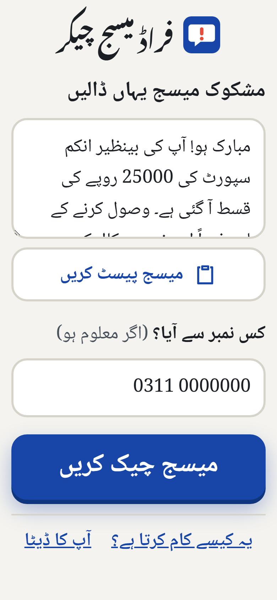
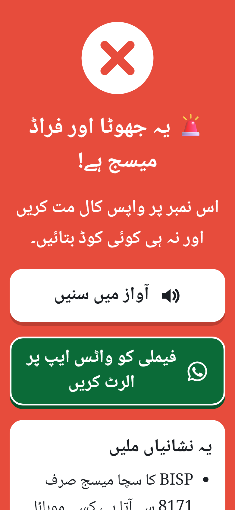
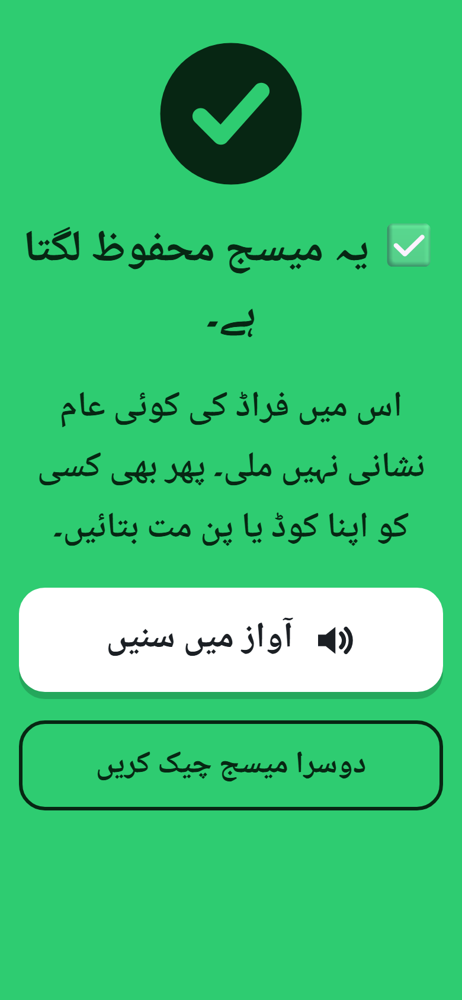

# فراڈ میسج چیکر · Scam SMS Checker

### [▶ Open the live app](https://scam-sms-checker.vercel.app/)

Every few days, phones in Pakistan get messages like these: a fake Benazir
Income Support (BISP) payment, a "Jeeto Pakistan" prize, or a warning that a
JazzCash or Easypaisa account is about to be blocked. Older parents are the
main target. This Urdu-first web app gives them a one-tap answer: paste the
message, and the whole screen turns **red (fraud)** or **green (looks safe)**.
They can hear the answer in Urdu and warn the family group on WhatsApp.

All checking happens on the phone. The message is never uploaded or saved.

**Live app:** [scam-sms-checker.vercel.app](https://scam-sms-checker.vercel.app/)

<p>
  
  
  
</p>

*Screenshots use the app's built-in made-up sample messages.*

## How it works

1. **Paste the message.** One large box, plus a «میسج پیسٹ کریں» button that
   reads the clipboard for anyone who finds long-press menus hard. An optional
   field takes the sender's number.
2. **Get a yes or no.** The verdict appears in well under half a second. A scam
   fills the screen with `#E74C3C` and «🚨 یہ جھوٹا اور فراڈ میسج ہے!». A
   message with no warning signs fills it with `#2ECC71` and
   «✅ یہ میسج محفوظ لگتا ہے۔». The signs that were found are listed in plain
   Urdu. A loudspeaker button reads the advice aloud.
3. **Warn the family.** A large WhatsApp button opens WhatsApp with a ready
   Urdu warning and the scam text quoted. Links in the quote are disabled
   (`bit[.]ly/…`) so nobody in the group taps them by accident.

### The rules

The checker (`src/lib/detect.js`) normalises the text first: Urdu and Arabic
digits, diacritics, and Arabic letter forms are folded together. Then it looks
for two kinds of signal.

| Strong signs (any one means fraud) | Weak signs (two together mean fraud) |
| --- | --- |
| BISP / Benazir / Ehsaas mentioned but not sent from **8171** (the *8171 rule*), or asking you to call a mobile number | A link to a site that isn't an official `.gov.pk`, JazzCash or Easypaisa domain |
| Prize, lottery, draw or "your number came out" (انعام، لاٹری، قرعہ اندازی، جیتو پاکستان) | A mobile number in the text |
| Threat that an account, card or SIM will be blocked | Pressure to act now (فوراً، آخری موقع، 24 گھنٹے) |
| Asking for a code, PIN or password (but not "do **not** share this code") | A fee, tax or Easyload demanded |
| A bank or wallet "contacting" you from an ordinary mobile number | Money promised (رقم، قسط، امداد، Rs.) |
| "I sent money to you by mistake, please return it" | A bank or wallet "helpline" |
| A short link (bit.ly, wa.me and similar) | |

Rules match Urdu script, Roman Urdu and English, and use Unicode-aware word
boundaries so short words like «سم» (SIM) don't match inside «موسم» or «قسم».
`src/lib/detect.test.js` checks the rules against a corpus of made-up scam
and genuine messages, including genuine OTP texts, a real-format 8171 message
and ordinary family chat.

**A green result is not a guarantee.** It means none of the known signs were
found. The app says so, and still reminds people never to share a code.

## Features

- **Urdu first, made for older eyes.** All text is 26–36px, Nastaliq headings
  and Naskh body text (Noto, self-hosted), main buttons 76px or taller, no
  sign-in and no settings.
- **Urdu voice.** Uses the phone's speech engine with an Urdu voice. If the
  phone has none, it uses a Hindi voice reading the same sentence written in
  Devanagari, because spoken Urdu and Hindi are the same for a sentence this
  simple. If neither exists, it says so instead of failing silently.
- **Works offline.** A service worker caches the app after the first visit.
- **Private by design.** No backend, storage, cookies or analytics. The message
  lives in memory only until the page is closed.
- **Accessible.** Labelled fields, inline errors, focus moved to each new
  screen's heading, visible focus rings in every colour scheme, and
  `prefers-reduced-motion` respected.

## Tech stack

React 19 (function components, plain JSX) · Vite · vanilla CSS · Vitest ·
Playwright · deployed on Vercel. There are no runtime dependencies beyond React
and two self-hosted font packages.

## Run it locally

```bash
npm install
npm run dev        # http://localhost:5173
npm test           # detection rules (Vitest)
npm run lint       # oxlint
npm run build      # production build in dist/
npm run e2e        # end-to-end tests (first time: npx playwright install chromium)
```

No environment variables are needed: the app has no backend or API keys.

`npm run capture` regenerates the PNG icons, the social preview image and the
screenshots above from a running build (see the comment in
`scripts/capture.mjs`).

## Project structure

```
src/
  lib/detect.js       detection rules and verdict
  lib/text.js         Urdu text normalisation and digit conversion
  lib/whatsapp.js     family alert text, link defanging, wa.me URL
  lib/speech.js       voice selection (Urdu, then Hindi) and spoken lines
  screens/            check, result, help/FAQ, privacy and 404 screens
  components/         voice button and screen header
public/sw.js          offline cache (asset list written in at build time)
e2e/                  Playwright tests (mobile and desktop)
```

## Privacy

See the in-app «آپ کا ڈیٹا» page. In short: nothing is uploaded, stored or
tracked. Some browsers' online voices send the *spoken sentence* to their
provider. That sentence is the app's fixed warning, never the user's message.

## Contributing and security

Found a scam the checker misses, or a false alarm? Open an issue with the
"Missed scam or false alarm" template, with personal details replaced. See
[CONTRIBUTING.md](CONTRIBUTING.md) and the [Code of Conduct](CODE_OF_CONDUCT.md).
Report security issues privately as described in [SECURITY.md](SECURITY.md).

## License

[MIT](LICENSE) © 2026 Fazal Abbas
